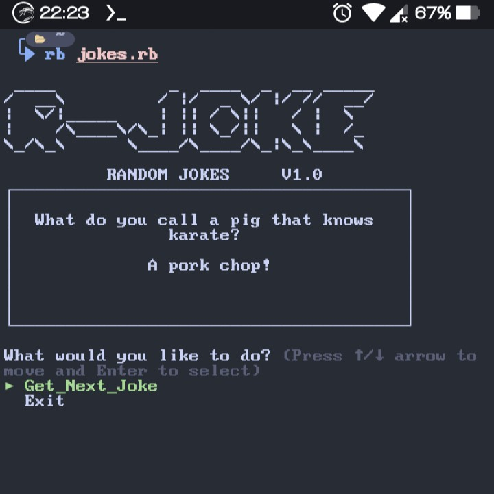
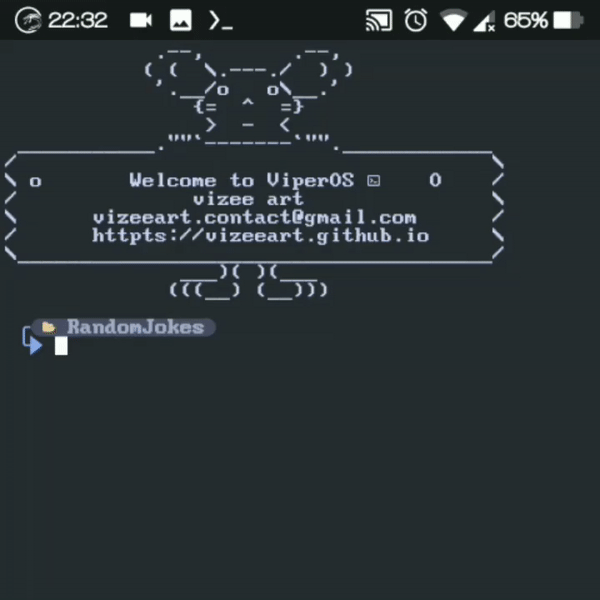

# RJokes

<p align="center">
  <a name="top" href="#octocat-hi-there-thanks-for-visiting-">
    
    
  </a>
</p>

# Info

<p align="center">

 <a href="https://github.com/vizeeart">
    
  </a>
<a href="https://github.com/vizeeart/followers">
  </a>
<a href="https://github.com/vizeeart/RJokes/stargazers/">
<a href="https://github.com/vizeeart">
  
</a>
<a href="https://github.com/vizeeart">
  
</a>
<a href="https://github.com/vizeeart">
  
</a>
<a href="https://github.com/vizeeart">
  
</a>
</div>
</p>

##
### :octocat: Hi, thanks for spending your time visiting this repository !
<p>
  R-jokes is a program that generates jokes at random.
</p>


# Installation Package
<details open>
<summary>Termux (Android) / Linux</summary>

- ```bash
  $ apt update && apt upgrade
  ```

- ```bash
  $ apt install ruby git -y
  & gem install tty-prompt whirly
  ```

## Installation Project

- ```bash
  $ git clone https://github.com/vizeeart/RJokes
  ```

- ```bash
  $ cd RJokes
  ```

- ```bash
  $ ruby jokes.rb
  ```⏎